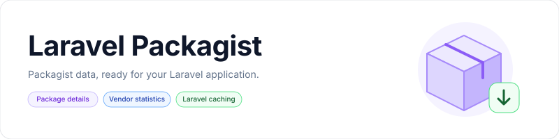

<p align="center">
    <picture>
        <source media="(prefers-color-scheme: dark)" srcset="art/banner-dark.svg">
        <source media="(prefers-color-scheme: light)" srcset="art/banner-light.svg">
        
    </picture>
</p>

<p align="center">Retrieve Packagist package details and vendor statistics from Laravel.</p>

<p align="center">
    <a href="https://packagist.org/packages/jeremykenedy/laravel-packagist"></a>
    <a href="https://packagist.org/packages/jeremykenedy/laravel-packagist"></a>
    <a href="https://github.com/jeremykenedy/laravel-packagist/actions/workflows/tests.yml"></a>
    <a href="https://github.styleci.io/repos/194171634"></a>
    <a href="LICENSE"></a>
</p>

## Table of Contents

- [Framework Support](#framework-support)
- [Requirements](#requirements)
- [Installation](#installation)
- [Upgrading](#upgrading)
- [Quick Start](#quick-start)
- [Blade](#blade)
- [Livewire](#livewire)
- [Vue, React, and Svelte](#vue-react-and-svelte)
- [API Methods](#api-methods)
- [Features](#features)
- [Configuration](#configuration)
- [Changing Frameworks](#changing-frameworks)
- [Artisan Commands](#artisan-commands)
- [Install Options](#install-options)
- [Testing](#testing)
- [License](#license)

## Framework Support

| Laravel | PHP versions in CI |
|---------|--------------------|
| 5.4, 5.5, 5.6, 5.7, 5.8 | 7.1 |
| 6, 7 | 7.2 |
| 8 | 7.3, 8.0 |
| 9 | 8.0 |
| 10 | 8.1 |
| 11, 12 | 8.2 |
| 13 | 8.3, 8.4, 8.5 |

Older Laravel versions remain covered for existing applications. Follow [Laravel's support policy](https://laravel.com/docs/releases#support-policy) when choosing a version for a new application.

This is a server-side API package. It has no routes, dashboard, views, or CSS dependencies. Your application's current frontend and theme stay in place when Composer updates the package.

## Requirements

- PHP 7.1.3 or later, subject to your Laravel version's requirements.
- Laravel 5.4 through 13.
- PHP cURL and JSON extensions.
- An HTTPS connection to Packagist, or a compatible configured endpoint.

## Installation

```bash
composer require jeremykenedy/laravel-packagist
php artisan packagist:install
```

Laravel 5.5 and later discover the service provider automatically. For Laravel 5.4, add this entry to `providers` in `config/app.php`:

```php
jeremykenedy\LaravelPackagist\LaravelPackagistServiceProvider::class,
```

The install command publishes configuration and translations. If the configuration already exists, it asks before publishing missing files. Existing files are preserved, including with `--force`. Publishing is optional; the package works with its defaults.

The original publishing commands remain available:

```bash
php artisan vendor:publish --provider="jeremykenedy\LaravelPackagist\LaravelPackagistServiceProvider"
php artisan vendor:publish --tag=laravelpackagist-config
php artisan vendor:publish --tag=laravelpackagist-lang
```

Translations are published under your application's language directory in `vendor/laravelpackagist`. This supports both the older `resources/lang` directory and newer applications using `lang`.

### Upgrading

```bash
composer update jeremykenedy/laravel-packagist
php artisan packagist:update
```

Composer updates do not publish files, change application configuration, install frontend packages, or add routes. The optional update command only publishes missing configuration and translations. It never overwrites customized files. New defaults are loaded from the package; review the [configuration file](src/config/laravelpackagist.php) if you want to override them.

Existing method names, arguments, translations, static calls, facade access, and cache keys remain available. Both historical package cache formats are readable, so a cache flush is not required. Package details now respect `vendorItemCacheTime`; earlier releases incorrectly used `vendorListCacheTime` for those entries. Both defaults remain 100 minutes.

## Quick Start

```php
use jeremykenedy\LaravelPackagist\App\Services\PackagistApiServices;

$package = PackagistApiServices::getVendorsPackageDetails('laravel/framework');
$downloads = PackagistApiServices::getPackageTotalDownloads('laravel/framework');
$packages = PackagistApiServices::getPackagistVendorRepositoriesList('laravel');
```

The `PackagistApiServices` class alias and `jeremykenedy\LaravelPackagist\LaravelPackagistFacade` are also available. Vendor methods use `laravelpackagist.vendor.default` when no vendor is supplied.

The following examples belong in your application. They do not require a frontend integration package.

### Blade

Fetch data in your controller:

```php
public function show()
{
    return view('packages.show', [
        'downloads' => PackagistApiServices::getPackageTotalDownloads('laravel/framework'),
    ]);
}
```

Render it in Blade:

```blade
<p>Total downloads: {{ $downloads }}</p>
```

### Livewire

Load the statistic in your component:

```php
public $downloads;

public function mount()
{
    $this->downloads = PackagistApiServices::getPackageTotalDownloads('laravel/framework');
}
```

Use `{{ $downloads }}` in its Blade view. Import `PackagistApiServices` in the component class.

### Vue, React, and Svelte

Expose the data through an application endpoint in `routes/web.php`:

```php
use Illuminate\Support\Facades\Route;
use jeremykenedy\LaravelPackagist\App\Services\PackagistApiServices;

Route::get('/package-downloads', function () {
    return response()->json([
        'downloads' => PackagistApiServices::getPackageTotalDownloads('laravel/framework'),
    ]);
});
```

Vue:

```vue
<script setup>
import { onMounted, ref } from 'vue';

const downloads = ref('Loading...');
onMounted(async () => {
    try {
        const response = await fetch('/package-downloads');
        if (!response.ok) throw new Error('Request failed');
        downloads.value = (await response.json()).downloads;
    } catch {
        downloads.value = 'Unavailable';
    }
});
</script>

<template><p>Total downloads: {{ downloads }}</p></template>
```

React:

```jsx
import { useEffect, useState } from 'react';

export default function PackageDownloads() {
    const [downloads, setDownloads] = useState('Loading...');

    useEffect(() => {
        let active = true;
        fetch('/package-downloads')
            .then(response => {
                if (!response.ok) throw new Error('Request failed');
                return response.json();
            })
            .then(data => { if (active) setDownloads(data.downloads); })
            .catch(() => { if (active) setDownloads('Unavailable'); });
        return () => { active = false; };
    }, []);

    return <p>Total downloads: {downloads}</p>;
}
```

Svelte:

```svelte
<script>
    import { onMount } from 'svelte';

    let downloads = 'Loading...';
    onMount(async () => {
        try {
            const response = await fetch('/package-downloads');
            if (!response.ok) throw new Error('Request failed');
            downloads = (await response.json()).downloads;
        } catch {
            downloads = 'Unavailable';
        }
    });
</script>

<p>Total downloads: {downloads}</p>
```

### API Methods

| Method | Arguments | Result |
|--------|-----------|--------|
| `getPackagistVendorRepositoriesList` | `$vendor = null` | Collection of package names |
| `getVendorPackagesCount` | `$vendor = null` | Package count |
| `getVendorsPackagesDetails` | `$vendor = null` | Collection of package objects |
| `getVendorsTotalDownloads` | `$vendor = null` | Sum of package downloads |
| `getVendorsTotalStars` | `$vendor = null` | Sum of Packagist `favers` |
| `getVendorsPackageDetails` | `$vendorAndPackage = null, $object = false` | Package array; object when `$object` is `true` |
| `getPackageDownloads` | `$vendorAndPackage = null, $type = null` | Downloads array, or selected `total`, `monthly`, or `daily` value |
| `getPackageDailyDownloads` | `$vendorAndPackage = null` | Daily downloads |
| `getPackageMonthlyDownloads` | `$vendorAndPackage = null` | Monthly downloads |
| `getPackageTotalDownloads` | `$vendorAndPackage = null` | Total downloads |
| `getPackageTotalForks` | `$vendorAndPackage = null` | GitHub forks |
| `getPackageTotalOpenIssues` | `$vendorAndPackage = null` | GitHub open issues |
| `getPackageTotalRepo` | `$vendorAndPackage = null` | Repository URL |
| `getPackageTotalStars` | `$vendorAndPackage = null` | GitHub stars |
| `getPackageTotalWatchers` | `$vendorAndPackage = null` | GitHub watchers |

For compatibility, missing or malformed package names and unavailable packages return translated error strings. Missing optional statistics return `null`. An unavailable vendor list returns an empty collection and is not cached. Vendor totals skip unavailable packages, so a partial upstream outage can produce a partial total.

`getVendorsTotalStars` retains its original meaning: it sums `favers`, rather than `github_stars`. Field availability and freshness depend on the [Packagist API](https://packagist.org/apidoc).

## Features

- Package details, download counts, repository details, and vendor totals.
- Optional Laravel caching with separate list and package lifetimes.
- Existing static service calls, class alias, and facade support.
- Configurable endpoints, request timeouts, and optional retries.
- Localized error messages.
- Install and update commands that preserve application files.

## Configuration

All settings are in [config/laravelpackagist.php](src/config/laravelpackagist.php). Existing configuration keys and environment variables are unchanged.

| Configuration key | Environment variable | Default |
|-------------------|----------------------|---------|
| `caching.enabled` | `PACKAGIST_CACHE_ENABLED` | `true` |
| `caching.vendorListCacheTime` | `PACKAGIST_VENDOR_LIST_CACHE_TIME_MINUTES` | `100` minutes |
| `caching.vendorItemCacheTime` | `PACKAGIST_VENDOR_ITEM_CACHE_TIME_MINUTES` | `100` minutes |
| `curl.timeout` | `PACKAGIST_CURL_TIMEOUT` | `30` seconds per attempt |
| `curl.connectTimeout` | `PACKAGIST_CURL_CONNECT_TIMEOUT` | `10` seconds per attempt |
| `curl.retries` | `PACKAGIST_CURL_RETRIES` | `0` additional attempts |
| `curl.maxredirects` | `PACKAGIST_CURL_MAX_REDIRECTS` | `10`, retained for compatibility; redirects are not followed |
| `urls.vendorBase` | `PACKAGIST_API_VENDOR_URL_BASE` | `https://packagist.org/packages/list.json?vendor=` |
| `urls.projectPreFix` | `PACKAGIST_API_VENDOR_PROJECT_BASE_PREFIX` | `https://packagist.org/packages/` |
| `urls.projectPostFix` | `PACKAGIST_API_VENDOR_PROJECT_BASE_POSTFIX` | `.json` |
| `vendor.default` | `PACKAGIST_DEFAULT_VENDOR` | `jeremykenedy` |
| `logging.curlErrors` | `PACKAGIST_LOG_CURL_ERROR` | `true` |

Retries are optional and capped at five. They apply to connection failures, HTTP 429, and HTTP 5xx responses, with delays starting at 100 milliseconds and doubling between attempts. Timeouts have a minimum of one second. Failed requests and invalid package responses are not cached.

```dotenv
PACKAGIST_DEFAULT_VENDOR=jeremykenedy
PACKAGIST_CACHE_ENABLED=true
PACKAGIST_VENDOR_LIST_CACHE_TIME_MINUTES=100
PACKAGIST_VENDOR_ITEM_CACHE_TIME_MINUTES=100
PACKAGIST_CURL_TIMEOUT=30
PACKAGIST_CURL_CONNECT_TIMEOUT=10
PACKAGIST_CURL_RETRIES=0
```

After changing environment settings in an application that caches configuration, rebuild that cache with `php artisan config:cache`.

## Changing Frameworks

Laravel Packagist does not own your application's views or CSS. Blade, Livewire, Vue, React, Svelte, Bootstrap 5, and Tailwind can consume the same data without changing this package's configuration. There are no `--css`, `--frontend`, or `packagist:switch` options.

`php artisan packagist:update` publishes missing package files and preserves your configuration. Framework changes belong to your application. Run `npm run build` after changing frontend assets if your application uses that build script.

## Artisan Commands

| Command | Description | Options |
|---------|-------------|---------|
| `packagist:install` | Publish configuration and translations; detect an existing installation | `--force`, `--no-interaction` |
| `packagist:update` | Publish missing files without overwriting existing configuration or translations | `--no-interaction` |
| `vendor:publish` | Laravel's existing publisher for this package | `--provider`, `--tag=laravelpackagist-config`, `--tag=laravelpackagist-lang` |

### Install Options

| Flag | Description |
|------|-------------|
| `--force` | Skip the existing installation confirmation. Existing files are still preserved. |
| `--no-interaction` | Run without prompts. If already installed, use `--force` or `packagist:update` to publish missing files. |

## Testing

```bash
composer install
composer test
```

The suite exercises all public API methods, service provider and facade bindings, legacy cache formats, cache lifetimes, upstream failures, real cURL requests against a local fixture server, and installation over customized files. Tests do not contact Packagist.

Pint runs separately so its PHP requirement does not raise the package's PHP minimum. Use PHP 8.3 or later for the current development tools:

```bash
composer --working-dir=tools install
composer lint
composer format
```

With Xdebug enabled:

```bash
XDEBUG_MODE=coverage vendor/bin/phpunit --coverage-filter src --coverage-clover coverage/clover.xml --coverage-text
```

[GitHub Actions](https://github.com/jeremykenedy/laravel-packagist/actions/workflows/tests.yml) runs the compatibility matrix, Pint, coverage, and an audit of the current dependency set. Legacy compatibility jobs allow older dependencies that are no longer supported upstream; they do not certify those frameworks as secure. [Scrutinizer](https://scrutinizer-ci.com/g/jeremykenedy/laravel-packagist/) runs analysis and coverage, with an A rating required for analyzed code.

## License

This package is open-sourced software licensed under the [MIT license](LICENSE).
